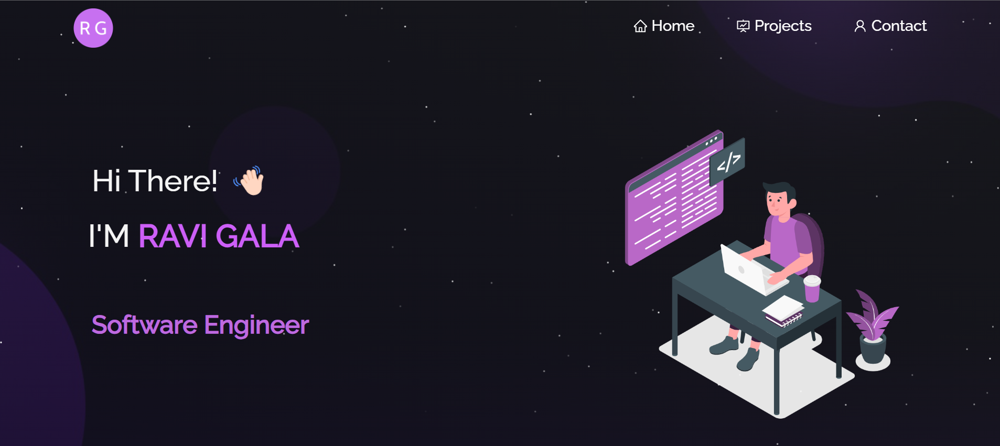
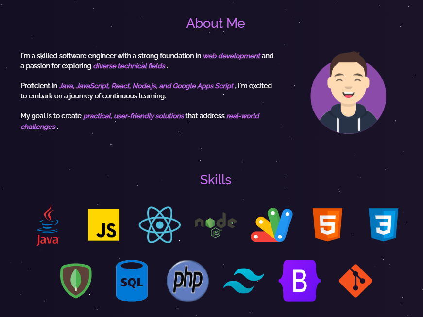
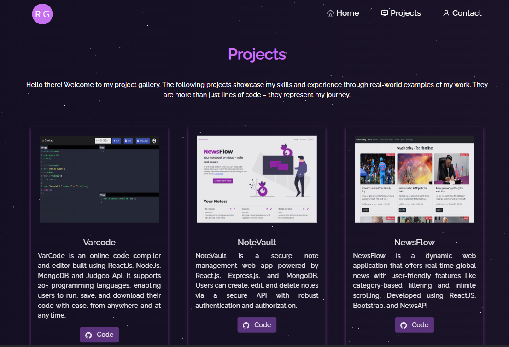
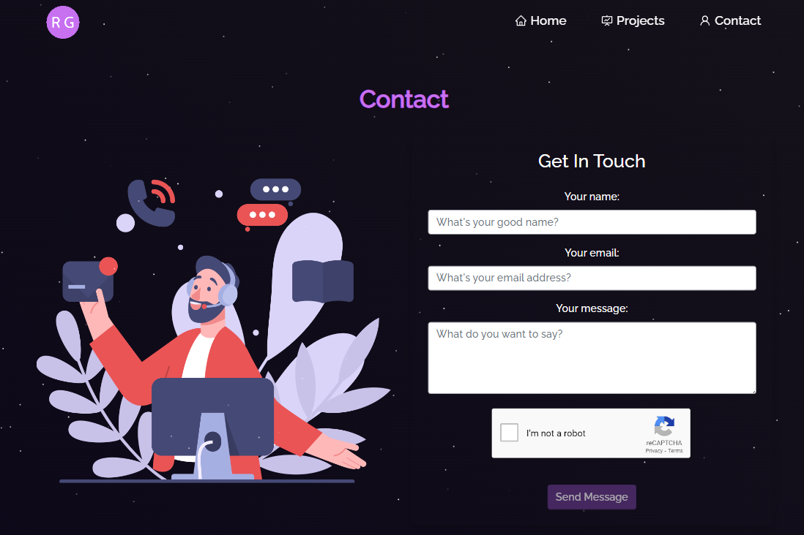

# Portfolio Website

Welcome to my portfolio website built using React.js, Node.js, Express.js, and Google App Script.

## Table of Contents
1. [Introduction](#introduction)
2. [Features](#features)
3. [Technologies Used](#technologies-used)
4. [Screenshots](#screenshots)
5. [How to Run](#how-to-run)
6. [Deployment](#deployment)

## Introduction

This is my personal portfolio website, designed to showcase my skills, projects, and provide a way for people to contact me.

## Features

- **Home Page:**
  - Introduction
  - About Me
  - Skills
  - Projects Section (with a button to navigate to the Projects page)

- **Projects Page:**
  - Displays a collection of my projects

- **Contact Page:**
  - Form for visitors to contact me

## Technologies Used

- React.js
- Node.js
- Express.js
- Google App Script

## Screenshots

### Home Page

### Projects Page

### Contact Page

## How to Run

1. Clone the repository.
2. Navigate to the project directory.
3. Install dependencies using `npm install`.
4. Run the development server using `npm start`.

## Deployment

The website is deployed and can be accessed [here](https://ravigala-portfolio.netlify.app/).

